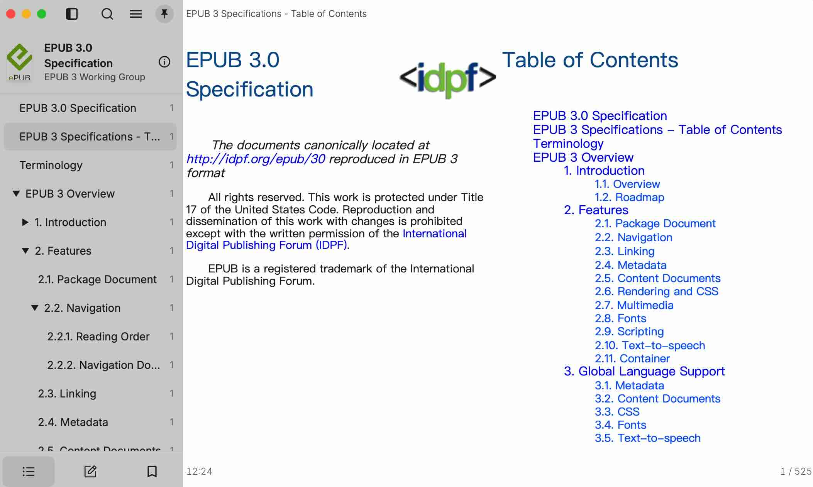
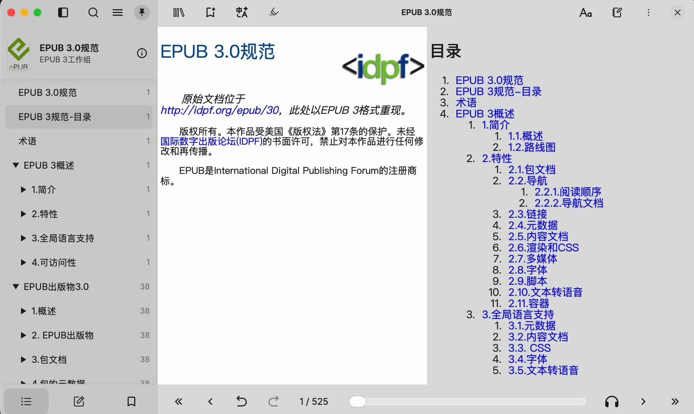

A simple translation robot to translate HTML/EPUB document based on LLMs.

Currently resuming at middle of HTML is not supported, though resuming at middle
of EPUB is possible, starting from the chapter next to the last previously completely
translated chapter, with order defined by the spine, given that the generated
temporary file is not removed.

## Example screen shots
<br/>The original
<br/>
<br/>After translation
<br/>

## For library use
See the API document at https://docs.rs/transbot. And see examples under `examples` sub directory.

## For command line use

See below `-h` output for its usage.
```text
Usage: transbot_cli [OPTIONS] --input-file <INPUT_FILE> --provider <PROVIDER> --model-name <MODEL_NAME>

Options:
  -i, --input-file <INPUT_FILE>
          The input HTML/EPUB file path
  -o, --output-file <OUTPUT_FILE>
          The output file path. The default is <orig_filename>.transbot.<orig_ext>, where <orig_filename>
          is the original file name and <orig_ext> is the original file extension
      --file-format <FILE_FORMAT>
          The format of the input file. If omitted, determined by the file extension.
  -p, --provider <PROVIDER>
          The LLM provider name. It can be 'openai', 'gemini', 'anthropic', 'zhipu', 'deepseek', 'qwen',
          'ollama[;url]' or 'custom;<api_style>;<url>', where url is the full URL of the LLM service,
          and api_style can be 'ollama', 'openai', 'gemini', or 'anthropic'.
          The default URL for ollama is 'http://localhost:13434/api/chat'.
  -m, --model-name <MODEL_NAME>
          The LLM model name
  -a, --api-key <API_KEY>
          The LLM api key
      --temperature <TEMPERATURE>
          The LLM temperature. The default is 0.1
      --llm-time-out <LLM_TIME_OUT>
          The time out of a single interaction with the LLM. The default is 300 seconds
      --prompt-topic <PROMPT_TOPIC>
          The topic to set in prompt
      --prompt-extra <PROMPT_EXTRA>
          The extra text (such as glossary) to set in prompt
      --full-prompt <FULL_PROMPT>
          The full prompt text. If it's set, it replaces the whole default prompt set
          by the program itself
  -d, --dest-lang <DEST_LANG>
          The language to translate into. The default is Chinese
      --html-elem-selector <HTML_ELEM_SELECTOR>
          The selector selecting which elements in the HTML file to translate, by providing
          the tag names and maybe their attributes. The default is 'p,h1,h2,h3,li'. Tag names are
          separated by commas. As an example, 'p,h1,h2,h3,li,code[class="c1"]' also selects `code`
          elements having 'class' attribute set to 'c1', which means comments in code blocks (but how
          code comments is defined is not common but specific to the HTML/EPUB file.
          Specify '*' to select all elements.
          And NOTICE that 'whole' means to pass the whole HTML to LLM to translate
      --syntax-strategy <SYNTAX_STRATEGY>
          The syntax strategy during translation. It can be 'byllm', 'bytransbot' or 'stripped'.
          The default is 'byllm'. This option is about how elements of non normal text, such as a link
          or an '<em>', etc, are maintained. 'byllm' means they're maintained by LLM, 'bytransbot' means
          they're maintained by this program, and 'stripped' means they're stripped. None of them is
          ideally perfect.
          It's IGNORED if the 'html_elem_selector' option is 'whole'
      --print-translating-text <PRINT_TRANSLATING_TEXT>
          Whether to print the text passed to LLM and the result text gotten from it. It's mainly for
          checking during trying this program on some LLM. The default is false [possible values: true, false]
      --clean-cjk-ascii-spacing <CLEAN_CJK_ASCII_SPACING>
          Whether to remove spaces between ASCII text (usually terminology) and the Chinese/Japanese/Korean
          text after translation. The spaces are usually added by the LLM during translation.
          The default is false [possible values: true, false]
  -h, --help
          Print help
```
